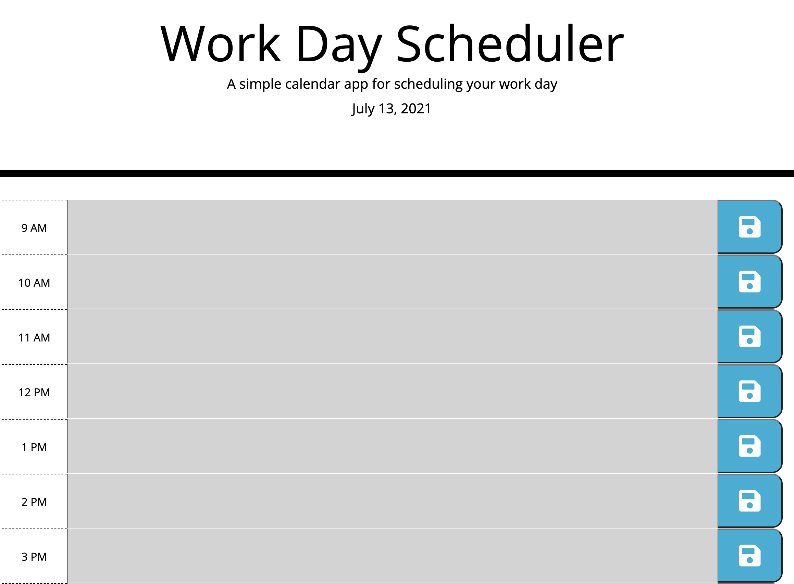

# Work_Day_Scheduler

## Background
- As an employee with a busy schedule, I have implemented the ability to add important events to a daily planner for time management efficiency.

## Scheduling Targets
- When the planner is open the current day is displayed at the tope of the calendar. 
- When scrolling through the planner one is able to see timeblocks for the given day.
- Timeblocks for the day are color coded to indicate whether it is past, present or future. 
- Each timeblock is fillable with text information. 
- Fillable information in the timeblock can be saved.
- All saved information in the timeblock is saved in local storage.
- Information remains upon page refresh.

# Quiz Preview 
> Preview  

## Repository & Webpage:
- URL: https://mgmedrano.github.io/Work_Day_Scheduler/
- GitHub Repository: https://github.com/mgmedrano/Work_Day_Scheduler
